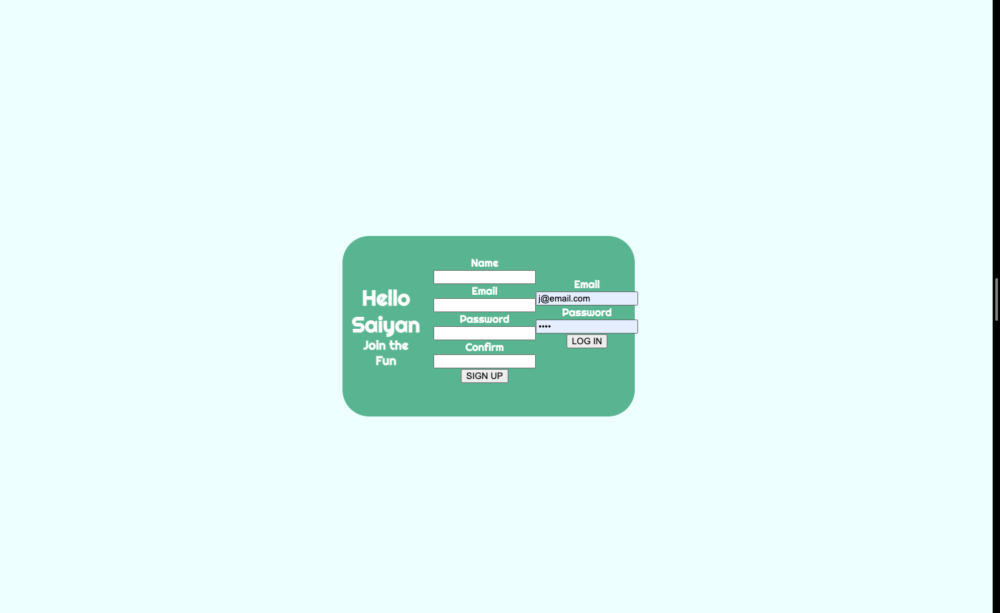
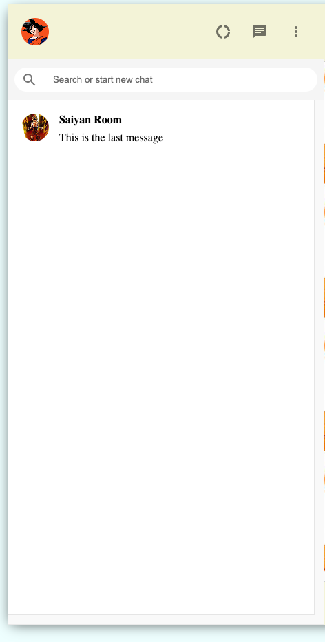
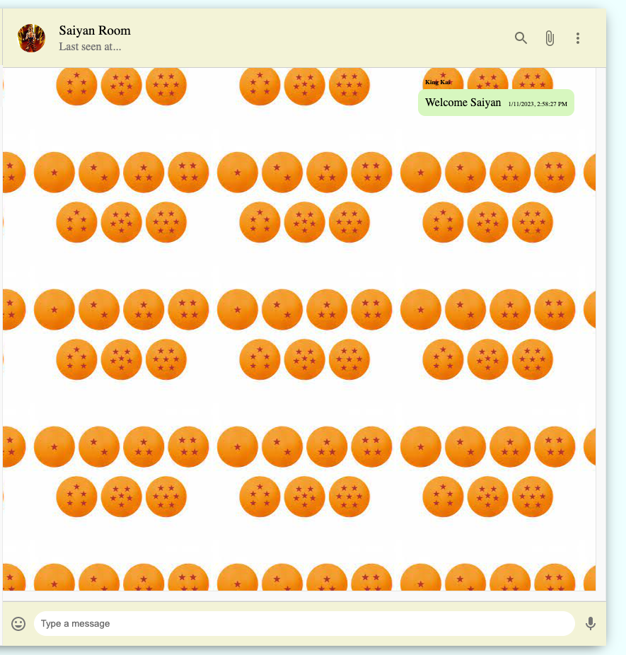

# Hello Saiyan

## An app that lets you talk to your fellow Saiyans

## This project is a clone of whats App. I got the inspiration for this project from having my own whatapp account. I think  its pretty cool how its the number one social media app around the world.

## Navigate to the signup page link

* The page will have you sign up before joining a room and creating a message( Enter yout name, email and passwoed )

* It should take you to the welcome room

* Start chatting

#### Tools and resources used:
- JavaScript
- Css
- HTML
- JSX
- MongoDB
- Express
- React
- Pusher

## Trello Board

View Trello Board
<a href="https://trello.com/b/W4tpO8cX/hello-saiyan">here</a>

